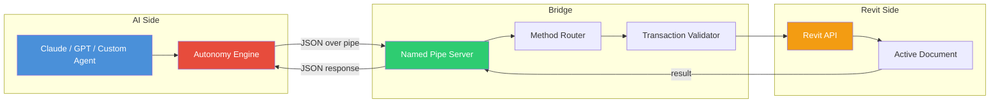

<p align="center">
  <h1 align="center">RevitMCPBridge</h1>
  <p align="center">
    <strong>Give AI full read-write access to Autodesk Revit. 705+ endpoints. Zero manual steps.</strong>
  </p>
  <p align="center">
    <a href="#quick-start">Quick Start</a> &middot;
    <a href="#what-it-enables">What It Enables</a> &middot;
    <a href="#api-categories">API Reference</a> &middot;
    <a href="#autonomy-levels">Autonomy Levels</a>
  </p>
  <p align="center">
    <a href="https://github.com/WeberG619/RevitMCPBridge2026/stargazers"></a>
    
    
    
    
    
    <a href="https://github.com/WeberG619/RevitMCPBridge2026/releases"></a>
  </p>
</p>

---

> **Coming from [revit-mcp](https://github.com/SamuraiBuddha/revit-mcp)?** That project was archived on Feb 26, 2026. RevitMCPBridge2026 is the actively maintained alternative with 705+ endpoints, named pipe communication (no crashes), and a 113-file architectural knowledge base. See [Quick Start](#quick-start) to get running in minutes.

---

## What is this?

RevitMCPBridge is a Revit add-in that exposes the entire Revit API through the Model Context Protocol (MCP) via named pipes. AI systems — Claude, GPT, custom agents — can read, create, modify, and validate anything in a Revit model programmatically. No Dynamo. No manual steps. Just send JSON, get results.

**For AEC professionals:** Your AI assistant can now open your Revit model and actually *do things* — create walls, place doors, generate sheets, check code compliance, produce construction documents.

**For developers:** 705+ typed endpoints with parameter validation, transaction management, and structured error responses. Connect any language that can write to a named pipe.

## Why Named Pipes Instead of HTTP?

Revit is single-threaded. Every API call must execute on the main UI thread.

| Approach | What Happens Under Load |
|---|---|
| **HTTP server** | Competes for the main thread. Multiple concurrent AI requests cause timeouts, dropped connections, and crashes. |
| **Named pipes** | Uses Revit's own `ExternalEvent` queue. Requests are serialized through the same mechanism Revit uses internally. Zero thread contention, zero crashes. |

Every other Revit MCP implementation uses HTTP. They work for simple demos but break under real workloads. Named pipes are why this bridge can handle 705+ endpoints reliably.

## Before and After

**Before RevitMCPBridge:**
```
You: "Create a sheet set for these 12 floor plans"
AI:  "Here are the steps you should follow manually in Revit:
      1. Go to View > Sheet Composition > New Sheet
      2. Select your title block...
      3. Repeat 12 times..."
```

**After RevitMCPBridge:**
```python
# AI executes directly in Revit
for i, view_id in enumerate(floor_plan_ids):
    call_revit("createSheet", {
        "sheetNumber": f"A1.{i+1}",
        "sheetName": f"Floor Plan - Level {i+1}",
        "titleBlockName": "E1 30x42 Horizontal"
    })
    call_revit("placeViewOnSheet", {
        "sheetId": sheet_id,
        "viewId": view_id,
        "locationX": 1.5,
        "locationY": 1.0
    })
# 12 sheets created, views placed, titled — in seconds
```

## What It Enables

| Capability | Methods | Example |
|---|---|---|
| **Read any model data** | Parameters, elements, geometry, schedules | Extract every door schedule to JSON |
| **Create elements** | Walls, doors, windows, rooms, structural, MEP | Build a floor plan from a PDF specification |
| **Modify elements** | Move, resize, reparameter, retype | Batch-update 200 door fire ratings |
| **Generate documents** | Sheets, views, schedules, annotations | Produce a full CD set automatically |
| **Validate models** | Code compliance, clash detection, QC | Check egress paths against IBC requirements |
| **AI autonomy** | Goal execution, learning, self-healing | "Set up this project" → 360 sheets, done |

## Scale

- **705+ MCP endpoints** across 25+ categories
- **146 C# source files**, 13,000+ lines
- **113 knowledge files** of architectural domain expertise (building codes, room standards, MEP systems, material specs)
- **68 unit tests** with NUnit
- **5 levels of autonomy** — from direct API calls to autonomous goal execution

## API Categories

| Category | Endpoints | What It Does |
|---|---|---|
| **Walls** | 11 | Create, modify, split, join, query wall elements |
| **Doors & Windows** | 13 | Place openings, configure hardware, set fire ratings |
| **Rooms** | 10 | Create rooms, compute areas, tag, set finishes |
| **Views** | 12 | Create plans, sections, elevations, 3D views |
| **Sheets** | 11 | Create sheets, place viewports, manage title blocks |
| **Schedules** | 34 | Create/modify schedules, export data, configure fields |
| **Families** | 29 | Load families, place instances, query types |
| **Parameters** | 29 | Get/set any parameter on any element |
| **Structural** | 26 | Beams, columns, foundations, framing |
| **MEP** | 35 | Ducts, pipes, equipment, electrical |
| **Details** | 33 | Detail lines, filled regions, detail components |
| **Filters** | 27 | View filters, graphic overrides, visibility |
| **Materials** | 27 | Material creation, assignment, appearance |
| **Phases** | 24 | Construction phases, phase filters |
| **Worksets** | 27 | Workset management for workshared models |
| **Annotations** | 33 | Dimensions, tags, text notes, keynotes |
| **Intelligence** | 35 | AI autonomy, learning, goal execution, self-healing |
| **Sheet Patterns** | 11 | Intelligent sheet numbering and organization |
| **Viewport Capture** | 7 | View capture, camera control |
| **Rendering** | 7 | AI-assisted rendering via Stable Diffusion |
| **System** | 6 | Health check, version, stats, method listing |

## Quick Start

### Prerequisites
- Autodesk Revit 2025 or 2026
- .NET Framework 4.8
- Visual Studio 2022 (for building from source)

### Install

```powershell
# Option 1: Installer script
git clone https://github.com/WeberG619/RevitMCPBridge2026.git
cd RevitMCPBridge2026
.\scripts\deploy\Install-RevitMCPBridge.ps1

# Option 2: Manual
msbuild RevitMCPBridge2026.csproj /p:Configuration=Release
copy bin\Release\RevitMCPBridge2026.dll "%APPDATA%\Autodesk\Revit\Addins\2026\"
copy RevitMCPBridge2026.addin "%APPDATA%\Autodesk\Revit\Addins\2026\"
copy appsettings.json "%APPDATA%\Autodesk\Revit\Addins\2026\"
```

### Connect

Start Revit, then from any language:

```python
import struct, json

PIPE_NAME = r'\\.\pipe\RevitMCPBridge2026'

def call_revit(method, params=None):
    """Call any Revit method via named pipe."""
    import win32file, win32pipe
    handle = win32file.CreateFile(
        PIPE_NAME, win32file.GENERIC_READ | win32file.GENERIC_WRITE,
        0, None, win32file.OPEN_EXISTING, 0, None
    )
    request = json.dumps({"method": method, "params": params or {}}).encode()
    win32file.WriteFile(handle, struct.pack('<I', len(request)) + request)
    size = struct.unpack('<I', win32file.ReadFile(handle, 4)[1])[0]
    data = win32file.ReadFile(handle, size)[1]
    handle.Close()
    return json.loads(data)

# Verify connection
print(call_revit("healthCheck"))
# {"status": "healthy", "documentOpen": true, "methodCount": 705}

# List all available methods
print(call_revit("getMethods"))
# {"methods": ["getVersion", "createWall", ...], "count": 705}
```

> **Note:** The bridge communicates via Windows named pipes (`\\.\pipe\RevitMCPBridge2026`), not HTTP. This provides direct in-process communication with Revit. For a simpler Python wrapper, see the `python/` directory.

### Your first wall

```python
# Create a wall
result = call_revit("createWall", {
    "startX": 0, "startY": 0,
    "endX": 20, "endY": 0,
    "wallTypeName": "Generic - 8\"",
    "levelName": "Level 1",
    "height": 10
})
print(result)
# {"success": true, "elementId": 123456, "length": 20.0}
```

## Autonomy Levels

The bridge supports 5 levels of AI autonomy:

| Level | Name | What It Does |
|---|---|---|
| **1** | Basic Bridge | Direct API translation. Send method, get result. |
| **2** | Context Awareness | Tracks element relationships, maintains session context. |
| **3** | Learning & Memory | Stores corrections, learns patterns for future use. |
| **4** | Proactive Intelligence | Detects workflow gaps, suggests next steps, anticipates needs. |
| **5** | Full Autonomy | Executes high-level goals with self-healing and guardrails. |

### Level 5 Example

```python
# "Set up construction document sheets" — one command
call_revit("executeGoal", {
    "goalType": "create_sheet_set",
    "parameters": {
        "viewIds": [123456, 234567, 345678],
        "sheetPattern": "A-{level}.{sequence}"
    }
})
# Creates sheets, places views, adds title blocks, numbers everything

# Safety guardrails
call_revit("configureAutonomy", {
    "maxElementsPerTask": 100,
    "allowedMethods": ["createWall", "placeDoor", "createSheet"],
    "blockedMethods": ["deleteElements"],
    "requireApprovalFor": ["deleteSheet"]
})
```

## Knowledge Base

The bridge includes 113 files of architectural domain knowledge:

| Category | Files | Coverage |
|---|---|---|
| Building Types | 17 | Residential, commercial, healthcare, education, hospitality, industrial |
| Building Codes | 15 | IBC, Florida Building Code (complete), NYC, California, Chicago |
| Structural & Envelope | 12 | Foundations, framing, walls, roofs, glazing, mass timber |
| MEP Systems | 10 | HVAC, electrical, plumbing, fire protection, elevators |
| Interior & Finishes | 9 | Kitchen/bath, materials, millwork, acoustics, door hardware |
| Codes & Regulatory | 9 | Accessibility, egress, energy, zoning, permitting |
| Project Delivery | 10 | Cost estimating, specifications, construction admin |
| Documentation | 7 | CD standards, annotation standards, detail libraries |

This knowledge base enables AI agents to make code-compliant, architecturally correct decisions without requiring the user to specify every standard.

## Connection to the Autonomy Engine

RevitMCPBridge is the flagship integration for the [Autonomy Engine](https://github.com/WeberG619/claude-ai-tools). When connected:

- **Goal tracking** — "Set up this project" becomes a tracked goal with sub-goals and progress
- **Correction learning** — BIM-specific mistakes get stored and injected into future Revit tasks
- **Alignment injection** — Every Revit agent gets compiled corrections for the BIM domain
- **Coordination** — Multiple agents can work on the same model with resource locking

```
User Goal: "Create construction documents"
    ↓
Autonomy Engine decomposes into plan:
    1. Create sheet set (SheetMethods)
    2. Place views on sheets (ViewMethods)
    3. Add annotations (AnnotationMethods)
    4. Generate schedules (ScheduleMethods)
    5. QC check (Intelligence)
    ↓
Each step gets BIM-domain alignment injection
    ↓
Corrections from past sessions prevent known mistakes
    ↓
Progress cascades to parent goal: 100%
```

## Configuration

```json
{
  "Pipe": {
    "Name": "RevitMCPBridge2026",
    "TimeoutMs": 30000,
    "MaxConnections": 5
  },
  "Logging": {
    "Level": "Information",
    "LogDirectory": "%APPDATA%/RevitMCPBridge/logs"
  },
  "Autonomy": {
    "Enabled": true,
    "MaxRetries": 3,
    "MaxElementsPerBatch": 100
  }
}
```

## Architecture



## Development

```bash
# Build
msbuild RevitMCPBridge2026.csproj /p:Configuration=Release

# Run tests
dotnet test tests/RevitMCPBridge.Tests.csproj

# Smoke test (requires Revit running)
python tests/smoke_test.py
```

## Troubleshooting

| Problem | Solution |
|---|---|
| Connection refused | Ensure Revit is running and add-in loaded (check ribbon) |
| Method not found | Run `getMethods` to list available methods. Names are case-sensitive. |
| Operation failed | Check that a document is open. Verify element IDs exist. |
| Timeout | Close any blocking Revit dialogs. Click in the drawing area. |

## Comparison with Other Revit MCP Implementations

| Feature | RevitMCPBridge2026 | revit-mcp (archived) | revit-mcp-commandset (archived) |
|---|---|---|---|
| **Status** | Active | Archived Feb 2026 | Archived Feb 2025 |
| **Endpoints** | 705+ | ~30 | ~50 |
| **Transport** | Named pipes | HTTP | HTTP |
| **Revit versions** | 2025, 2026 | 2025 | 2025 |
| **Knowledge base** | 113 files | None | None |
| **Autonomy levels** | 5 (basic → full) | 1 | 1 |
| **Transaction safety** | Built-in | Manual | Manual |

## License

MIT License. See [LICENSE](LICENSE).

## Author

**Weber Gouin** — [BIM Ops Studio](https://bimopsstudio.com)

The first open-source bridge connecting AI to Autodesk Revit through the Model Context Protocol.

## Contributing

See [CONTRIBUTING.md](CONTRIBUTING.md) for guidelines. Issues and PRs welcome.

---

<p align="center">
  <em>Stop describing Revit workflows to AI. Start executing them.</em>
</p>
